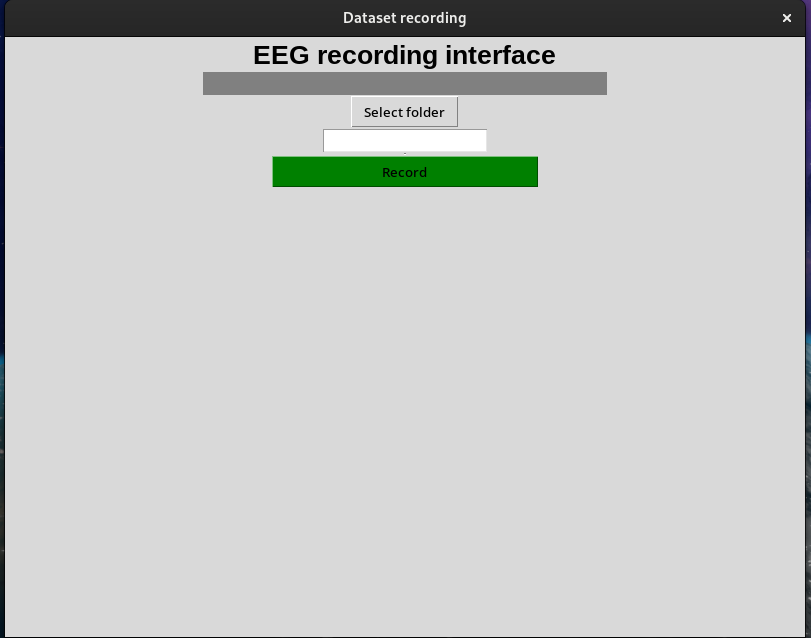
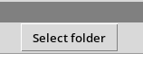
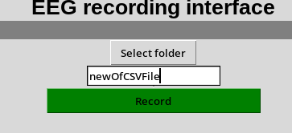

# FlagEEG_v1
Repo of the winter EEG project by the Club d'Intelligence Artificielle of Laval University. The goal of this project is to interpret EEG signals in order to transform them into realtime game inputs.

# Table of Contents
- [FlagEEG_v1](#flageeg_v1)
- [Python version](#python-version)
- [How to get started with the project](#how-to-get-started-with-the-project)
- [How to get started with python](#how-to-get-started-with-python)
- [How to get started with the EEG](#how-to-get-started-with-the-eeg)
  - [1. Install the OpenBCI GUI](#1-install-the-openbci-gui)
  - [2. Connect your computer to the helmet](#2-connect-your-computer-to-the-helmet)
  - [3. Read the OpenBCI docs](#3-read-the-openbci-docs)
- [How to run the baseline](#how-to-run-the-baseline)

## Python version
Repo is tested for python 3.12.8

## How to get started with the project
1. Go read the `project-chart.md` [here](/management/project-chart.md)
2. Go read the `project-organization-manual.md` [here](/management/project-organization-manual.md)

## How to get started with python
1. Install python (please chose the python 3.12 version)
2. Install the Git CLI (useful stuff for any programmer)
3. Clone the FLapEEG_v1 repo with this command : 
```git clone git@github.com:cia-ulaval/FlagEEG_v1.git```
_(If it doesn't work, you need to setup an SSH key on your GitHub account)_
4. Open the cloned repo with a Text Editor of your choice
5. Create a virtual environnement for your python dependencies with the command : 
```python -m venv venv```
6. Activate the virtual env :
- For linux, mac : `source venv/bin/activate`
- For Windows : `venv/Scripts/activate`
7. Download the dependencies :
```pip install -r requirements.txt```

## How to get started with the EEG
### 1. Install the OpenBCI GUI : [download](https://openbci.com/downloads)
This is the official OpenBCI support user interface to allow streaming and seeing data from the EEG. Please download it and follow the installation instructions.
- [Download](https://openbci.com/downloads)
- [Installation instructions](https://docs.openbci.com/Software/OpenBCISoftware/GUIDocs/)

**Important for Linux users** : For Linux users only, there is a necessary hardware step, to make in order to allow the necessary permissions for your USB ports. Go look at the [tutorial](https://docs.openbci.com/Software/OpenBCISoftware/GUIDocs/#linux-users-serial-port-permissions) of the fix. The fix is in the section : _Linux Users: Serial Port Permissions_

### 2. Connect your computer to the helmet
1. Connect the Daisy dongle to your USB port
2. Run the OpenBCI GUI on your computer and start a streaming session : CYTON -> Serial (from Dongle) 

### 3. Read the OpenBCI docs
To help connect your python scripts and the EEG helmet, OpenBCI provides us with a SDK : [Brainflow](https://docs.openbci.com/ForDevelopers/SoftwareDevelopment/). Go read the docs to learn how python and the EEG interacts.


## How to run the baseline


## How to run the annotation pipeline
1. Setup the env : 
    
    `python -m venv venv`

    `source venv/bin/activate`
    
    `pip install -r requirements.txt`

2. Connect the EEG with the dongle
3. Start the pipeline : 

    `python main_annotation.py`

    An interface like this should show up : 
    
3. Select the target folder where all the `.csv` files are exported : 

    
4. Write the name that your exported `.csv` file will take :

    ⚠️ **Important:** 

        - Do NOT write `.csv` in the name, the extension is automatically   added.


        - The new data recorded is appended to the end of the document  inputed. So if you want to have separate files for different recording session, change the name of the input.


    

5. Start recording with the **Record** button. A window is supposed to show up to help you annotate your EEG data. Please blink when the **FlappyBrain** shows up.

6. Stop recording with the red **Stop** button.

